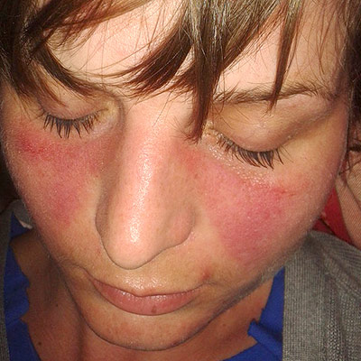
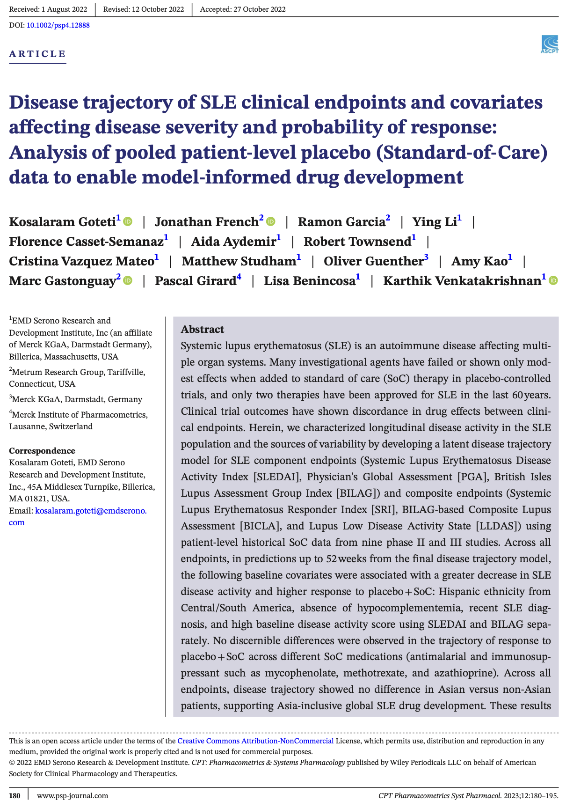

------------------------------------------------------------------------

## 医薬品開発と ICH

::: {style="font-size:0.75em; color:#666; margin-bottom:1em;"}
医薬品の審査に要求されるエビデンスを規制当局間で統一するための国際的枠組み
:::

:::: {.callout-note title="International Council for Harmonisation of Technical Requirements for Pharmaceuticals for Human Use（ICH）"}
"ICH brings together the medicines regulatory authorities and
pharmaceutical industry around the world. ICH aims to achieve greater
harmonisation worldwide for the development and approval of safe,
effective, and high-quality medicines in the most resource-efficient
manner."

::: {style="font-size:0.7em; color:#888; text-align:right;"}
— European Medicines Agency
:::
::::

::::: columns
::: {.column width="50%"}
#### 沿革

- 1990 年、EU / US / Japan の 3 極合意として発足
- 2015 年、スイス法下の非営利組織として再編
- 17 の Regulatory Members、32 の Observers（2026 年時点）
:::

::: {.column width="50%"}
#### 今日の発表で登場する ICH ガイドライン

- **M15** — MIDD 総則（2 日前に EMA 発効）
- **E17** — 多地域臨床試験の設計と実施
- **E5** — 外国臨床データの受け入れ／民族差
:::
:::::

::: notes
今日は、R
による分析そのものの話はしません。Rを使った分析結果をエビデンスとして、
医薬品開発の意思決定に活用するための規制について話します。

まず前提として、ICH という枠組みからお話しします。
これは、医薬品の審査に要求されるエビデンスを規制当局間で統一するための、
国際的な枠組みです。安全で有効な医薬品を効率的に開発し、そのエビデンスを
審査して承認するための基準を国際的に調和させることを目指しています。

1990 年に日米欧の 3 極合意として発足し、2015
年に非営利組織として再編されました。 今日は M15、E17、E5 という 3
つのガイドラインが登場します。 特に M15 は、EMA で 2
日前に発効したばかりの、MIDD の総則です。
:::

------------------------------------------------------------------------

## MIDD：モデルが医薬品開発の意思決定を支える

::: {style="font-size:0.7em; color:#666; margin-bottom:0.8em;"}
Model-Informed Drug Development ──
臨床試験だけに頼らず、モデリング&シミュレーションで意思決定を支援する
:::

:::::::::::::::::::::: {style="display:grid; grid-template-columns:1fr 1fr 1fr; gap:12px;"}
::::: {style="background:white; border:0.5px solid #ddd; border-radius:8px; padding:10px;"}
::: {style="text-align:center; font-size:0.65em; font-weight:500; color:#333;"}
母集団薬物動態／薬力学（popPK/PD）モデル
:::

::: {style="text-align:center; font-size:0.55em; color:#888;"}
非線形混合効果モデル
:::

```{r}
#| label: mns-poppk
#| fig-width: 3.8
#| fig-height: 1.5
suppressPackageStartupMessages({
  library(ggplot2)
})
t <- seq(0, 30, length.out = 200)
A <- 100; alpha <- 0.8; B <- 25; beta <- 0.08
median_c <- A * exp(-alpha * t) + B * exp(-beta * t)
df <- data.frame(
  t = t,
  median = median_c,
  upper = median_c * 3.0,#1.6
  lower = median_c * 0.33 #0.55
)
ggplot(df, aes(x = t)) +
  geom_ribbon(aes(ymin = lower, ymax = upper),
              fill = "#2a78d6", alpha = 0.15) +
  geom_line(aes(y = median), color = "#2a78d6", linewidth = 0.8) +
  scale_y_log10(limits = c(0.5, 450)) +
  theme_void() +
  theme(
    axis.line = element_line(color = "#bbb", linewidth = 0.3),
    plot.margin = margin(t = 2, r = 4, b = 2, l = 4)
  )
```
:::::

::::: {style="background:white; border:0.5px solid #ddd; border-radius:8px; padding:10px;"}
::: {style="text-align:center; font-size:0.65em; font-weight:500; color:#333;"}
生理学的薬物動態（PBPK）モデル
:::

::: {style="text-align:center; font-size:0.55em; color:#888;"}
常微分方程式系
:::

```{=html}
<div style="display:flex; align-items:center; justify-content:center; height:200px; padding:4px 0;">
<svg viewBox="0 0 200 100" width="100%" style="max-width:380px;">
  <defs>
    <marker id="arrPBPK" viewBox="0 0 10 10" refX="9" refY="5" markerWidth="5" markerHeight="5" orient="auto">
      <path d="M0,0 L10,5 L0,10 z" fill="#666"/>
    </marker>
    <marker id="arrCL" viewBox="0 0 10 10" refX="9" refY="5" markerWidth="5" markerHeight="5" orient="auto">
      <path d="M0,0 L10,5 L0,10 z" fill="#993c1d"/>
    </marker>
  </defs>
  <rect x="8"   y="10" width="30" height="16" rx="3" fill="#f5f5f0" stroke="#888" stroke-width="1"/>
  <text x="23" y="21" text-anchor="middle" font-size="7" fill="#333">Gut</text>
  <rect x="8"   y="42" width="30" height="16" rx="3" fill="#e1f5ee" stroke="#1D9E75" stroke-width="1"/>
  <text x="23" y="49" text-anchor="middle" font-size="6" fill="#0f6e56">Portal</text>
  <text x="23" y="55" text-anchor="middle" font-size="6" fill="#0f6e56">vein</text>
  <rect x="8"   y="74" width="30" height="16" rx="3" fill="#e1f5ee" stroke="#1D9E75" stroke-width="1"/>
  <text x="23" y="85" text-anchor="middle" font-size="7" fill="#0f6e56">Liver</text>
  <rect x="90"  y="42" width="34" height="16" rx="3" fill="#e6f1fb" stroke="#378add" stroke-width="1"/>
  <text x="107" y="49" text-anchor="middle" font-size="6" fill="#0c447c">Systemic</text>
  <text x="107" y="55" text-anchor="middle" font-size="6" fill="#0c447c">compart.</text>
  <line x1="23" y1="26" x2="23" y2="42" stroke="#666" stroke-width="1" marker-end="url(#arrPBPK)"/>
  <line x1="23" y1="58" x2="23" y2="74" stroke="#666" stroke-width="1" marker-end="url(#arrPBPK)"/>
  <path d="M38,82 Q65,82 88,54" fill="none" stroke="#666" stroke-width="1" marker-end="url(#arrPBPK)"/>
  <path d="M90,46 Q65,30 38,46" fill="none" stroke="#666" stroke-width="1" marker-end="url(#arrPBPK)"/>
  <line x1="23" y1="90" x2="23" y2="98" stroke="#993c1d" stroke-width="1.2" marker-end="url(#arrCL)"/>
  <text x="30" y="97" font-size="6" fill="#993c1d" font-style="italic">CL_hep</text>
  <line x1="124" y1="50" x2="140" y2="50" stroke="#993c1d" stroke-width="1.2" marker-end="url(#arrCL)"/>
  <text x="144" y="52" font-size="6" fill="#993c1d" font-style="italic">CL</text>
</svg>
</div>
```
:::::

::::: {style="background:white; border:0.5px solid #ddd; border-radius:8px; padding:10px;"}
::: {style="text-align:center; font-size:0.65em; font-weight:500; color:#333;"}
曝露ー反応（Exposure-Response）モデル
:::

::: {style="text-align:center; font-size:0.55em; color:#888;"}
ロジスティック回帰／Cox比例ハザードモデル
:::

```{r}
#| label: mns-er
#| fig-width: 3.8
#| fig-height: 1.8
x <- seq(0, 20, length.out = 200)
df <- data.frame(
  x = x,
  y = 1 / (1 + exp(-(x - 10) * 0.6))
)
ggplot(df, aes(x = x, y = y)) +
  geom_line(color = "#2a78d6", linewidth = 0.9) +
  theme_void() +
  theme(
    axis.line = element_line(color = "#bbb", linewidth = 0.3),
    plot.margin = margin(2, 4, 2, 4)
  )
```
:::::

::::: {style="background:white; border:0.5px solid #ddd; border-radius:8px; padding:10px;"}
::: {style="text-align:center; font-size:0.65em; font-weight:500; color:#333;"}
定量的システム薬理学（QSP）モデル
:::

::: {style="text-align:center; font-size:0.55em; color:#888;"}
非線形・大規模常微分方程式系
:::

```{=html}
<div style="display:flex; align-items:center; justify-content:center; height:200px; padding:4px 0;">
<svg viewBox="0 0 180 90" width="100%" style="max-width:330px;">
  <ellipse cx="90" cy="45" rx="82" ry="38" fill="#f8f4ee" stroke="#7F77DD" stroke-width="1.2"/>
  <ellipse cx="90" cy="45" rx="14" ry="10" fill="#EEEDFE" stroke="#534AB7" stroke-width="0.8"/>
  <text x="18" y="30" font-size="6.5" fill="#3C3489" font-family="serif" font-style="italic">dC1/dt = k1·A - k2·C1</text>
  <text x="20" y="43" font-size="6.5" fill="#3C3489" font-family="serif" font-style="italic">dR/dt = kin - kout·R</text>
  <text x="14" y="56" font-size="6.5" fill="#3C3489" font-family="serif" font-style="italic">dE/dt = k·(1-E)·S</text>
  <text x="18" y="69" font-size="6.5" fill="#3C3489" font-family="serif" font-style="italic">dP/dt = g·C1·R - d·P</text>
  <text x="112" y="22" font-size="6.5" fill="#3C3489" font-family="serif" font-style="italic">dS/dt = a·E - b·S</text>
  <text x="115" y="71" font-size="6.5" fill="#3C3489" font-family="serif" font-style="italic">dT/dt = r·P - k·T</text>
</svg>
</div>
```
:::::

::::: {style="background:white; border:0.5px solid #1D9E75; border-radius:8px; padding:10px;"}
::: {style="text-align:center; font-size:0.65em; font-weight:500; color:#1D9E75;"}
Disease Trajectory Model (DTM)
:::

::: {style="text-align:center; font-size:0.55em; color:#888;"}
潜在クラス混合モデル (LCMM) / 混合効果モデル
:::

```{r}
#| label: mns-dtm
#| fig-width: 3.8
#| fig-height: 1.5
mu <- 10; lam <- 0.06
tt <- seq(0, 52, length.out = 100)
traj <- function(t, delta) mu + delta * (1 - exp(-lam * t))
df <- data.frame(
  t = rep(tt, 3),
  y = c(traj(tt, -3), traj(tt, -7), traj(tt, -2)),
  grp = rep(c("ref", "hisp", "other"), each = length(tt))
)
ggplot(df, aes(x = t, y = y, color = grp, linetype = grp)) +
  geom_line(linewidth = 0.8) +
  scale_color_manual(values = c(ref = "#888780", hisp = "#1D9E75", other = "#D85A30")) +
  scale_linetype_manual(values = c(ref = "solid", hisp = "dashed", other = "dotted")) +
  scale_y_continuous(limits = c(2, 11)) +
  theme_void() +
  theme(
    axis.line = element_line(color = "#bbb", linewidth = 0.3),
    legend.position = "none",
    plot.margin = margin(2, 4, 2, 4)
  )
```
:::::

:::::: {style="background:#e6f3ee; border:0.5px solid #1D9E75; border-radius:8px; padding:12px; display:flex; flex-direction:column; justify-content:center; align-items:center; text-align:center;"}
::: {style="font-size:0.6em; color:#666; margin-bottom:6px;"}
今日の事例はここ
:::

::: {style="font-size:1.8em; color:#1D9E75; font-weight:500; line-height:1;"}
→
:::

::: {style="font-size:0.6em; color:#333; margin-top:6px; line-height:1.4;"}
SLE の DTM を\
R で読み解く
:::
::::::
::::::::::::::::::::::

::: notes
冒頭のスライドで "Model-Informed Drug Development と R" と述べました。
MIDDとは "Model-Informed Drug Development" の略で、modeling &
simulationで予め「何を試すべきか」を検討し、医薬品開発の次の段階のデータ
を収集するための意思決定を支援するアプローチです。

ここに代表的な技術を並べました。このほかにも多々ありますが、母集団薬物動態の
popPK/PD、 生理学的薬物動態 PBPK、曝露ー反応関係を検討する
Exposure-Response、 システム薬理学
QSP、そして今日の主題である疾患進行モデル Disease Trajectory Model。
種類は違っても、共通点が二つあります。

一つは、すべて R で実装できること。
もう一つは、いずれも意思決定のためのモデルだということです。
今日はこの中の DTM を、SLEという疾患 の事例で読み解いていきます。
:::

------------------------------------------------------------------------

## なぜ今日ICH M15の話題なのか？

:::: {.callout-important title="ICH M15：General Principles for Model-Informed Drug Development"}
::: {style="font-size: 1.8em; width: 100%;"}
|             |                           |
|-------------|---------------------------|
| 段階        | 日付                      |
| Step 4 採択 | 2026年1月29日             |
| EMA 発効    | **2026年7月23日 ← 2日前** |
| FDA 最終化  | 2026年6月                 |
:::
::::

::: {.fragment style="text-align:center; font-size:1.5em; margin-top:2.4em;"}
MIDD の実施と評価の共通言語が、\
**世界で初めて成立した**
:::

::: notes
7月23日、EMAでICH M15が発効しました。 Model-Informed Drug Development
に関するICH初の包括的な総則です。
これまでMIDD関連の要求はE4、E5、E17、M12、M13
など個別のガイドラインに分散していて、横断的な上位原則がありませんでした。
世界で初めてこれが束ねられた。 今日の発表は、その2日後です。
:::

------------------------------------------------------------------------

## M15が変えるもの：MIDDの思想的な転換

:::::::: columns
:::: {.column width="48%"}
::: {.callout-note title="❌ 従来の想定"}
モデル構築法の技術的な規定
:::
::::

::: {.column width="4%"}
:::

:::: {.column width="48%"}
::: {.callout-tip title="⭕️ M15 が規定するもの"}
モデルから生成されたエビデンスを\
**どう評価し、当局と共有するか**
:::
::::
::::::::

::: {style="text-align:center; font-size:1.4em; margin-top:1.5em; color:#1D9E75;"}
"how to model" ではなく\
**"how to assess and communicate"**
:::

::: {.small style="margin-top:1.5em;"}
- 思想的源流：ASME V&V 40（医療機器 credibility 評価規格）
- キーワード：risk-based / fit-for-purpose / context-of-use
- 手法非依存：popPK/PD、PBPK、E-R、QSP、DTM ── すべてに適用
:::

::: notes
M15の思想的な核心を先にお話しします。
このガイドラインは、モデルをどう作るかを規定していません。
規定しているのは、モデルが示す洞察やシミュレーションで得られたエビデンスを
どう評価し、当局とどう対話するか、です。 "how to model" ではなく、"how
to assess and communicate"。
これは重要な転換で、モデリングを補助的な技術活動から、
意思決定支援の正式な規制上の営みへ格上げする文書だ、と
総論資料では表現されています。

思想的源流は医療機器のcredibility評価規格であるASME V&V 40（2018）です。
risk-basedとfit-for-purposeという発想が製薬MIDDに翻案されています。
:::

------------------------------------------------------------------------

## M15をどう読むか：3つの問いに整理する

::: {.callout-note title="① モデルは何のために作られたか？" appearance="minimal"}
- Question of Interest (QoI)
- context of use
- Model Analysis Plan (MAP) の事前規定
:::

::: {.callout-note title="② モデルは信じてよいか？" appearance="minimal"}
- verification（計算の正確性）
- validation（データ・知識との整合）
- applicability（用途への適切性）
:::

::: {.callout-note title="③ モデルの結果は意思決定にどう影響するか？" appearance="minimal"}
- model influence（決定への重み）
- consequence of wrong decision
- model risk = influence × consequence
:::

::: {style="text-align:center; margin-top:1em; color:#666;"}
これらすべてが **assessment table** として文書化される
:::

::: notes
公式文書の構造とは異なりますが、本発表では、M15は文書全体を通して3つの問いに答えることを求めていると捉えます。
モデルは何のために作られたか、モデルは信じてよいか、
モデル由来のエビデンスは意思決定にどう影響するか。 この3つが assessment
table という形で文書化され、 開発計画から規制申請までを貫きます。
今日はこの3つの問いで、SLE Disease Trajectory Model という
実際の事例を読み解いていきます。
:::

------------------------------------------------------------------------

## 経時的に変化する疾患重症度とその解析

:::::::: columns
:::: {.column width="55%"}
#### 現代の用量選択：Exposure-Response

$$\text{logit}(P[\text{response}]) = \alpha + \beta \cdot \text{exposure}$$

- exposure = AUC, C~max~, C~trough~, C~avg~
- 使用パッケージ：`glm()`, `lme4`, `nlme`

#### 安全性・イベント時間の解析

- Cox 比例ハザードモデル → `survival::coxph()`
- exposure で層別化 → `survival`, `survminer`

::: {style="text-align:right; margin-top:0.1em;"}
{width="55px"}
{width="55px"}
:::
::::

::::: {.column width="45%"}
::: {.fragment style="font-size:0.95em; color:#1D9E75;"}
**しかし**\
時間とともに変化する疾患重症度と用量／曝露量の関係をどうモデル化するか？
:::

```{=html}
<div style="display:flex; align-items:center; justify-content:space-between;
            margin-top:1.2em; padding:0 0.5em; font-family:inherit;">
  <div style="text-align:center; color:#333;">
    <div style="font-size:0.9em; line-height:1.3;">ベースライン</div>
    <div style="font-size:0.75em; color:#888;">[重症]</div>
  </div>
  <div style="flex:1; height:2px; background:#888; margin:0 0.8em;
              position:relative;">
    <div style="position:absolute; right:-1px; top:-6px;
                width:0; height:0;
                border-top:7px solid transparent;
                border-bottom:7px solid transparent;
                border-left:12px solid #888;"></div>
  </div>
  <div style="text-align:center; color:#333;">
    <div style="font-size:0.9em; line-height:1.3;">52週後</div>
    <div style="font-size:0.75em; color:#888;">[？]</div>
  </div>
</div>
```

::: {.fragment style="text-align:center; font-size:1.15em; color:#1D9E75; margin-top:2em;"}
→ **Disease Trajectory Model (DTM)**
:::
:::::
::::::::

::: notes
現代の用量選択は、用量そのものではなく exposure、つまり AUC や Cmax
といった 身体が薬物に曝された量を説明変数にした exposure-response
解析が主流です。 安全性や time-to-event
の解析では、exposureを共変量とする Cox 比例ハザードモデルや、exposure
で層別化した生存解析が使われます。

これらは静的なスナップショットです。
SLEのように高いプラセボ応答が時期や個人差
によってしっかんの活動性がバラバラな疾患では、症状治療効果の検出が難しく、
疾患の経過そのものをモデル化する、というアプローチが必要になります。
:::

------------------------------------------------------------------------

## SLE：試験デザインが困難な自己免疫疾患

::::::: columns
:::: {.column width="38%"}
{width="90%"
fig-alt="Malar rash（顔面紅斑）、SLE の典型的な皮膚症状"}

::: {style="font-size:0.55em; color:#888; margin-top:0.3em;"}
Systemic Lupus Erythematosus（全身性エリテマトーデス）\
\
Malar rash（顔面紅斑）\
Doktorinternet, CC BY-SA 4.0,\
via Wikimedia Commons
:::
::::

:::: {.column width="62%"}
#### 多臓器を侵す全身性の自己免疫疾患

- 皮膚（顔面紅斑・光線過敏）、腎、関節、神経、循環器、血液
- 高いプラセボ + 標準治療応答率により治療効果を示すことが困難

#### 活動性の評価尺度は複雑

- **SLEDAI** ─ 24 項目・9 臓器系の重み付き累積指標
- **BILAG** ─ 9 臓器系の順序尺度による複合指標
- **PGA** ─ 医師による 0–100 mm の視覚アナログ評価
- etc.

::: {.callout-warning appearance="minimal" style="margin-top:0.1em;"}
客観的で単一の効果指標が存在しない\
→ 過去 60 年で承認薬わずか 2 剤
:::
::::
:::::::

::: notes
今日の事例は SLE、全身性エリテマトーデスという自己免疫疾患です。
典型的な症状が、写真の顔面の紅斑。malar rash、蝶形紅斑とも呼ばれ、 SLE
の分類基準の一つになっています。

SLE の難しさは、皮膚だけでなく腎臓、関節、神経、循環器、血液と、
複数の臓器系にまたがって症状が現れることです。
だから評価尺度も複雑で、SLEDAI、BILAG、PGA といった指標があり、
単一の客観的な指標では捉えられません。

その結果、過去 60 年で承認された治療薬はわずか 2 剤です。
効果を客観的に評価しにくい疾患だからこそ、
モデリングのアプローチが意味を持ちます。
:::

------------------------------------------------------------------------

## 事例：DTM (Goteti et al. 2023) の全体像

::::::::: columns
::::::: {.column width="60%"}
::: {style="font-size:0.6em; color:#666; margin-bottom:1em;"}
Disease trajectory of SLE clinical endpoints and covariates\
affecting disease severity and probability of response\
Goteti et al. *CPT: PSP* 2023;12(2):180-195. doi:10.1002/psp4.12888

**タグ**：問い①（QoI と context of use）
:::

::: {.callout-tip title="Question of Interest（明示的に）"}
プラセボ + 標準療法群の SLE
疾患軌跡を定量化し、疾患重症度と応答確率に影響する共変量を同定する
:::

::: {.callout-note title="Context of Use"}
MIDD
の基盤モデルとして、新薬臨床試験のデザイン・組み入れ計画・エンドポイント選択を情報化する
:::

::: {.callout-important title="Impact on decision-making（後継論文で顕在化）"}
Model-Based Meta Analysis (MBMA)（Goteti et al. 2024,
doi:10.1002/psp4.13083）のプラセボ軌跡モデルとして 6
医薬品の効果量ベンチマーク基盤に
:::
:::::::

::: {.column width="40%"}
{fig-alt="Goteti et al. 2022 論文タイトル"}
:::
:::::::::

::: notes
きょう取り上げる事例はGotetiらが2023年に journal に発表した論文です。
M15の観点で最初に確認するのは Question of Interest です。
この論文は『プラセボ+標準療法の疾患軌跡を定量化する』ことを
明確な問いとして立てています。そして context of useは、
後続の新薬開発判断への情報提供です。実際、この基盤モデルは2024年のMBMA論文で
6つの化合物の効果量比較の共通尺度として使われました。
問いありきで設計されたモデル、というM15の要求を体現しています。
:::

------------------------------------------------------------------------

## モデルの構造：潜在変数θと9エンドポイント

::: {style="font-size:0.6em; color:#666; margin-bottom:0.5em;"}
**タグ**：問い①（モデル設計）
:::

$$\theta_{ik}(t) = \mu_{ik} + \delta_{ik} \times \left(1 - e^{-\lambda_{ik} \cdot t}\right)$$

:::::: columns
::: {.column width="100%"}
#### パラメータの意味

- $\mu_{ik}$：ベースライン疾患重症度
- $\delta_{ik}$：長期変化の大きさ **← 地域差はここ**
- $\lambda_{ik}$：到達速度
:::

:::: {.column width="100%"}
```{r}
#| label: theta-structure-diagram
#| fig-width: 6
#| fig-height: 4.5
library(DiagrammeR)
library(DiagrammeRsvg)
library(htmltools)

graph <- grViz("
  digraph G {
    graph [layout = dot, rankdir = TB, bgcolor='transparent']
    node [shape = box, fontname = 'sans-serif', fontsize = 11,
          style = 'filled,rounded', fillcolor = '#ffffff', color = '#333']

    theta [label = 'theta(t)\\nLatent Disease Activity',
           fillcolor = '#e6f3ee', color = '#1D9E75', fontsize = 14]

    SLEDAI [label = 'SLEDAI']
    BILAG  [label = 'BILAG']
    PGA    [label = 'PGA']
    aPEDD  [label = 'aPEDD']
    SRI    [label = 'SRI']
    BICLA  [label = 'BICLA']
    LLDAS  [label = 'LLDAS']
    Drop   [label = 'Dropout']

    theta -> {SLEDAI BILAG PGA aPEDD SRI BICLA LLDAS Drop}
      [color = '#666', arrowsize = 0.7]
  }
")

HTML(export_svg(graph))
```

::: {.small style="text-align:center;"}
9つのエンドポイントを1つの潜在変数で統合
:::
::::
::::::

::: notes
モデルの核心は θ という潜在変数です。
直接観測できない疾患の重さを数式で定義し、
SLEDAIやBILAG、PGAなど9つのエンドポイントを
このθの関数として表現しています。
ひとつの潜在変数が複数の観測を駆動する、 これが M15
が言う『モデル全体としての整合性を評価する』 対象になる部分です。
:::

------------------------------------------------------------------------

## R と Stan で実装した

::: {style="font-size:0.6em; color:#666; margin-bottom:0.5em;"}
**タグ**：問い②（verification／再現性・トレーサビリティ）
:::

::: {.callout-note title="論文本文からの引用"}
"Data integration, visualization, modeling, and simulations were
conducted using **R version 3.6**, and estimation and inference were
carried out using Bayesian methods implemented in **Stan version 2.4**
via **RStan package version 2.21.2**."
:::

::::::::: columns
:::: {.column width="45%"}
::: {.callout-note title="使用されたソフトウェア"}
```         
      R 3.6
        │
        ├── データ統合・可視化
        ├── モデリング・シミュレーション
        │
        └── RStan 2.21.2
              │
              └── Stan 2.4（NUTS サンプラー）
```
:::
::::

:::: {.column width="10%"}
::: {style="text-align: left; padding-top: 4.5em;"}
{width="65px"}
:::
::::

:::: {.column width="45%"}
::: {.callout-important title="M15 の要求"}
- valid computerized system
- コード検証の文書化
- 環境固定・バージョン管理（再現性・トレーサビリティ）
:::
::::
:::::::::

::: {style="margin-top:1em; color:#1D9E75; font-size:0.9em;"}
**R 3.6 / Stan version 2.4 / RStan package version 2.21.2**
という固定バージョン記載は、\
**M15が明文化した方向性と軌を一にする**
:::

::: notes
実装は R 3.6 と RStan 2.21.2、Stan 2.4 です。 M15 は valid computerized
system
やコード検証の文書化、環境固定を求めます。これは事実上の再現性・トレーサビリティ
要件です。この論文が2023年の時点でバージョンを明記していることは、M15が明文化
した方向性と軌を一にすると読めます。Rを規制文書に載せるとは、
単に走らせることではなく、どのRを使ったかを記録することでもある、
ということです。
:::

------------------------------------------------------------------------

## 過学習はいまや規制事項である

::: {style="font-size:0.6em; color:#666; margin-bottom:0.5em;"}
**タグ**：問い①（Model Analysis Planning）+
問い②（手法固有バイアスへの対処）
:::

::::::: columns
::::: {.column width="42%"}
::: {.callout-important title="M15 は AI/ML のリスクを名指しした"}
- **overfitting（過学習）**
- 選択バイアス
- 知識ギャップ

規制文書が、AI/ML 固有のリスクを\
明示的に評価対象とした
:::

::: {style="font-size:0.8em; color:#1D9E75; margin-top:0.8em;"}
この研究では、皆さんが explainable AI (XAI)\
で使う **Shapley値（SHAP）**が共変量選択に使\
われた ─ M15 が求める**バイアスへの対処**を\
具体的な手法で満たした一例
:::
:::::

::: {.column width="58%"}
```{=html}
<svg width="100%" viewBox="0 0 680 340" role="img" style="max-width:700px;">
  <defs>
    <marker id="arrowCS" viewBox="0 0 10 10" refX="8" refY="5" markerWidth="6" markerHeight="6" orient="auto-start-reverse">
      <path d="M2 1L8 5L2 9" fill="none" stroke="#666" stroke-width="1.5" stroke-linecap="round" stroke-linejoin="round"/>
    </marker>
  </defs>
  <rect x="240" y="20" width="200" height="50" rx="8" fill="#F1EFE8" stroke="#5F5E5A" stroke-width="0.5"/>
  <text x="340" y="40" text-anchor="middle" dominant-baseline="central" font-size="14" font-weight="500" fill="#2C2C2A">候補変数：数十個</text>
  <text x="340" y="57" text-anchor="middle" dominant-baseline="central" font-size="12" fill="#5F5E5A">年齢・人種・罹病期間・抗体…</text>

  <line x1="240" y1="60" x2="165" y2="95" stroke="#666" stroke-width="1.5" marker-end="url(#arrowCS)"/>
  <line x1="440" y1="60" x2="515" y2="95" stroke="#666" stroke-width="1.5" marker-end="url(#arrowCS)"/>

  <rect x="40" y="100" width="250" height="90" rx="8" fill="#E6F1FB" stroke="#185FA5" stroke-width="0.5"/>
  <text x="165" y="122" text-anchor="middle" dominant-baseline="central" font-size="14" font-weight="500" fill="#0C447C">統計側フィルタ</text>
  <text x="165" y="145" text-anchor="middle" dominant-baseline="central" font-size="14" fill="#042C53">LASSO 回帰</text>
  <text x="165" y="166" text-anchor="middle" dominant-baseline="central" font-size="12" fill="#185FA5">罰則付きで係数を絞る → glmnet</text>

  <rect x="390" y="100" width="250" height="90" rx="8" fill="#EEEDFE" stroke="#534AB7" stroke-width="0.5"/>
  <text x="515" y="118" text-anchor="middle" dominant-baseline="central" font-size="14" font-weight="500" fill="#3C3489">機械学習側フィルタ</text>
  <text x="515" y="140" text-anchor="middle" dominant-baseline="central" font-size="12" fill="#26215C">RF + Boruta + Shapley値（SHAP）</text>
  <text x="515" y="166" text-anchor="middle" dominant-baseline="central" font-size="12" fill="#534AB7">重要度検定・寄与度分解 → iml</text>

  <line x1="165" y1="190" x2="310" y2="235" stroke="#666" stroke-width="1.5" marker-end="url(#arrowCS)"/>
  <line x1="515" y1="190" x2="370" y2="235" stroke="#666" stroke-width="1.5" marker-end="url(#arrowCS)"/>

  <rect x="230" y="240" width="220" height="60" rx="8" fill="#E1F5EE" stroke="#0F6E56" stroke-width="1"/>
  <text x="340" y="262" text-anchor="middle" dominant-baseline="central" font-size="14" font-weight="500" fill="#085041">両方を通過した変数のみ採用</text>
  <text x="340" y="283" text-anchor="middle" dominant-baseline="central" font-size="12" fill="#0F6E56">＝ 過学習・選択バイアスへの防御</text>
</svg>
```
:::
:::::::

::: {style="text-align:center; font-size:0.95em; color:#666; margin-top:0.6em;"}
M15は、AIガバナンスを **具体的な手続きとして明文化した先行事例**
のひとつ
:::

::: notes
ここでは少し挑発的に「過学習はいまや規制事項である」としました。

M15 は、AI/ML
に固有のリスクを指摘しています。過学習、選択バイアス、知識ギャップ。
規制当局が AI/ML のガバナンスに正面から踏み込んだ、ということです。

では今日のDTMの事例はどう対処したか。統計側の LASSO と、機械学習側の
Random
Forest・Boruta・Shapley値。この2系統を独立に走らせ、両方で選ばれた変数
だけを採用しています。単一手法を信じない多重確認、過学習への防御です。

一点、正確にお伝えします。M15 は SHAP
のような特定の手法を明示しているわけでは ありません。M15
が求めるのは「バイアスに対処せよ」という原則で、その原則を満たす
具体的な手法として、この研究では SHAP が使われた。つまり、皆さんが
explainable AI
で日常的に使う手法も、規制当局がエビデンスとなるモデルの実装になっている、
ということです。
:::

------------------------------------------------------------------------

## モデル評価の三層：verification / validation / applicability

::: {style="font-size:0.6em; color:#666; margin-bottom:0.5em;"}
**タグ**：問い②（Model Evaluation の核心）
:::

::: {.callout-note title="① verification（計算の正確性）" style="font-size:0.85em"}
コード・式・計算のエラーフリー保証\
─ user-generated code の検証
:::

::: {.callout-tip title="② validation（データ・知識との整合）" style="font-size:0.85em"}
モデル全体としてのデータ・事前情報との整合\
─ **この論文での実装**：

- Rhat \< 1.05（MCMC 収束）
- トレースプロット目視
- VPC（Visual Predictive Check）
- WAIC / LPD（情報量規準）
- Somers' D（応答予測の識別能）
:::

::: {.callout-important title="③ applicability assessment（用途への適切性）" style="font-size:0.85em"}
各 intended use に対する fit-for-purpose 判断\
─ 地域差・共変量分布のカバレッジ検証
:::

::: {style="text-align:center; font-size:0.9em; color:#666; margin-top:1em;"}
従来 "validation" の一語で曖昧に括られていた領域を **M15
は明確に三層に分解した**
:::

::: notes
M15の中でもっとも実務的なインパクトが大きいのがここです。 従来validation
の一語で曖昧に括られていた領域を、verification、validation、applicability
という三層に分解しました。Verificationはコードが正しく動くこと。Validationは
モデル全体としてデータと整合していること。Applicabilityは各用途に対して適切
であること。Gotetiらの論文では、Rhat、トレースプロット、VPC、WAIC、Somers'
D ——これらすべてを R で実装しています。 Rはモデルを走らせるだけでなく、
モデルの信頼性の判定を補助も提供します。
:::

------------------------------------------------------------------------

## モデルが発見したこと：地域ごとに疾患の経過が異なる

::: {style="font-size:0.6em; color:#666; margin-bottom:0.5em;"}
**タグ**：問い③（model risk と model impact の核心）
:::

```{r}
#| label: dtm-interactive
#| fig-width: 12.5
#| fig-height: 5.5
source("dtm_chart.R")
build_dtm_chart()
```

::: {.small style="text-align:center; color:#666; margin-top:0.5em;"}
Hispanic – C/S America の δ 係数 = **−0.987** (95%CI: −1.25, −0.73)\
ベースラインは同じ ／ 長期軌跡は地域ごとに大きく違う
:::

::: notes
【スライダーを操作しながら】

モデルが医薬品開発での意思決定を支援する例をみてみましょう。
上のグラフを見てください。ベースライン——試験開始時の疾患重症度は三群で
ほぼ同じです。
しかし52週後、中南米系Hispanicの軌跡が大きく下がっています。
δ係数は−0.987。ベースラインではなく、長期的な疾患の動きが地域によって異なる。
このことは中南米HispanicのSLE患者は薬物治療なし、あるいは標準治療だけでも
疾患活動が低下する、有り体に言えばこの集団で医薬品のSLE治療効果を示すのは難しい。

下のスライダーを動かしてみます。 Hispanic C/S
Americaからの組み入れが0%のとき、
プラセボ応答率は約39%。治療群が70%とすれば 差は31ポイント。有意差あり。
組み入れが60%になると、プラセボ応答率が66%まで上昇し、治療効果はわずか4ポイント
になります。同じ薬、同じ試験デザイン、でも結果が逆転する。

M15 の用語で言うと、これは model influence
が最も高い場面です。モデルの結論が
直接、試験デザインを変える。誤れば患者と企業と規制当局 すべてに
consequence が及びます。 だからこそ、先ほど見た厳密な model evaluation
が求められていた ——という流れで読めます。
:::

------------------------------------------------------------------------

## 地域差 × ICH E17：Multi-Regional Clinical Trial (MRCT) 設計への含意

::: {style="font-size:0.6em; color:#666; margin-bottom:0.5em;"}
**タグ**：問い③（意思決定への影響）
:::

::: callout-note
- **ICH E17**：MRCTの設計と実施に関するガイドライン
- **ICH E5**：外国臨床データの受け入れ / 民族差
:::

#### DTM がもたらしたもの

- 地域差を post-hoc ではなく、**事前に定量化**して試験デザインに組み込む
- 組み入れ比率の設計根拠を、経験則ではなく **モデルで示せる**

#### M15 × E17 × E5 が織りなす構造

| ガイドライン | 役割                                 |
|--------------|--------------------------------------|
| **M15**      | モデルの信頼性評価と文書化の共通言語 |
| **E17**      | MRCTの実施原則                       |
| **E5**       | 民族差の受容基準                     |

::: {style="text-align:center; margin-top:0.8em; color:#1D9E75;"}
三者を横断する assessment table がグローバル同時開発の文書効率を高める
:::

::: notes
日本が主導して策定されたICH
E17は、国際共同臨床試験での地域差の取り扱いを定めた
ガイドラインです。このDTMは、地域差をpost-hocに分析するのではなく、試験設計の
前に定量化する手段として機能します。
M15、E17、E5の三つがそれぞれの側面から、
同じ問題——地域差をどう扱うか——にアプローチしています。
:::

------------------------------------------------------------------------

## Proprietary Software から OSS へ、そして「使えるパッケージ」とは

::: {style="font-size:0.7em; color:#666; margin-bottom:0.8em;"}
M15 時代に広がる MIDD ワークフローの選択肢
:::

:::::::::: columns
::::: {.column width="50%"}
#### M15 は method-agnostic を明文化

::: small
|   | 従来 | M15 以後 |
|------------------------|------------------------|------------------------|
| 生物統計 | SAS など | R など OSS 利用の拡大 |
| MIDD | NONMEM など | `nlmixr2` パッケージなど |
| 信頼性 | エビデンスの信頼性は validation された proprietary software 使用に依存 | ツールに依存せずモデルによるエビデンスの信頼性を評価する枠組み |
:::

::: {style="font-size:0.85em; color:#1D9E75; margin-top:0.3em;"}
評価の焦点は**モデルによるエビデンスの信頼性**

ツール選択は相対化される
:::
:::::

:::::: {.column width="50%"}
#### モデルの信頼性を左右する要素

（Rパッケージを例に）

::: {.callout-note appearance="minimal" style="margin-bottom:0.3em;"}
**質の保証** ─ モデル選択、感度解析、共変量選択の妥当性
:::

::: {.callout-note appearance="minimal" style="margin-bottom:0.3em;"}
**資産の再利用性** ─ 次の意思決定への継承\
（適応追加、市販後評価、後継製品開発）
:::

::: {.callout-note appearance="minimal" style="margin-bottom:0.3em;"}
**パッケージエコシステムの成熟度**\
CRAN 登録・継続的維持 vs. カスタム＋メンテ不足
:::
::::::
::::::::::

::: {.callout-important style="margin-top:0.8em;"}
`renv` は環境凍結には有効 ─ でも M15
の観点からの関心は「**健全なエコシステム上に載っているか**」

**カスタムパッケージかつメンテナンス不足**なパッケージへの依存は、審査上の潜在的なリスク要因
:::

::: {style="text-align:center; font-size:0.95em; color:#1D9E75; margin-top:0.8em;"}
わたしたちが使う R
パッケージは、医薬品開発の意思決定基盤として**選ばれる資産にもなる**
:::

::: notes
私自身、個人的に非線形混合効果モデルを扱う時は nlmixr2
を使ってきましたが、業務 では NONMEM
で確立したワークフローで公式な解析を行います。一方、M15 は
method-agnostic、手法非依存を明文化しました。評価の焦点は
「モデルによるエビデンスの信頼性」に移り、ツール選択は相対化される。SAS
から R へ、NONMEM から nlmixr2 へという OSS への移行を、暗黙のうちに M15
は後押しします。

規制当局が MIDD に求めるのは、単なるバイト一致の再現性ではありません。
関心があるのはおそらく三つ。解析の質、資産の再利用性、そして 我々 R
ユーザーには 身近な OSS
のパッケージやライブラリのエコシステムの成熟度です。

例えば CRAN
に登録され継続的に維持されるパッケージは、当局から見て扱いやすい。
逆に、メンテナンス不足のカスタムパッケージへの依存は、審査上のリスク要因になりうる。
renv
は環境の凍結には有効ですが、問われているのはそもそも健全なエコシステムに
載っている環境で MIDD を実践しているか、なんです。

私たちが日常的に使う R
パッケージは、医薬品開発の意思決定基盤として選ばれる
資産にもなる。そのことをお伝えして、まとめに入りたいと思います。
:::

------------------------------------------------------------------------

## Take Home Message

### **1. あなたが使う R は、医薬品開発で用いられる R と「同じ」**

`glm` も `survival` も
`Shapley値（SHAP）`も医薬品開発と規制の両方の意思決定を支える\
違いは「どの分野の問いに答えるか」だけ

### **2. サンプリングが、結論を反転させる**

SLE 試験の地域割付も、あなたのデータの標本抽出も、同じ構造\
だから M15 は「モデルによるエビデンスの信頼性」を評価する

### **3. 健全なエコシステムに載った R パッケージは、規制科学の「資産」になる**

あなたの貢献と日々の利用が、その基盤を支える

::: notes
今日のプレゼンから3点、改めて強調したいと思います。

まず、あなたが使う R は、医薬品開発で使う R と同じです。 glm も survival
も SHAP も、医薬品開発とその規制の両方の意思決定に入っている。
違うのは、経済データ、地理データなど、どの分野の問いに答えるか、それだけです。

次に。サンプリングが、結論を反転させる。 SLE
試験の参加者割付地域も、皆さんのデータの標本抽出も、同じ構造です。
だから M15 は、モデルによるエビデンスの信頼性を評価する。

もう1点は。健全なエコシステムに載った R
パッケージは、医薬品開発と規制科学の
資産になる。皆さんのコントリビューションと日々の利用が、その基盤を支えます。

この分野に関心を持たれたかたがいらしたら、ぜひお話ししましょう。
:::

------------------------------------------------------------------------

:::: columns
::: {.column width="100%" style="text-align:center; font-size:6em; margin-top:1em;"}
Enjoy!
:::
::::

::: notes
ご清聴ありがとうございました。
:::

------------------------------------------------------------------------

## 引用・出典 {visibility="uncounted"}

::: small
**主要論文**\
Goteti K, French J, Garcia R, et al. Disease trajectory of SLE clinical
endpoints and covariates affecting disease severity and probability of
response. *CPT Pharmacometrics Syst Pharmacol.* 2023 Feb;12(2):180-195.
doi:10.1002/psp4.12888 (PMCID: PMC9931431)

**後継論文**\
Goteti K, Garcia R, Gillespie WR, French J, et al. Model-based
meta-analysis using latent variable modeling to set benchmarks for new
treatments of SLE. *CPT Pharmacometrics Syst Pharmacol.* 2024
Feb;13(2):281-295. doi:10.1002/psp4.13083

**ICH M15**\
ICH M15 Guideline "General Principles for Model-Informed Drug
Development" (Step 4 adopted 2026-01-29). EMA/CHMP/ICH/496426/2024, Step
5 発効 2026-07-23. FDA Federal Register 2026-11112 (2026-06-03).

**ICH 定義の引用**\
European Medicines Agency,
<https://www.ema.europa.eu/en/partners-networks/international-activities/multilateral-coalitions-initiatives/international-council-harmonisation-technical-requirements-registration-pharmaceuticals-human-use-ich>

**画像出典**\
Malar rash: Doktorinternet, CC BY-SA 4.0, via Wikimedia Commons\
<https://commons.wikimedia.org/wiki/File:Lupusfoto.jpg>

**Interactive chart の免責**\
δ係数は論文 Table S5 の実値。軌跡・応答率はモデルパラメータに\
基づく概念的例示であり、実際の臨床試験データではありません。
:::
